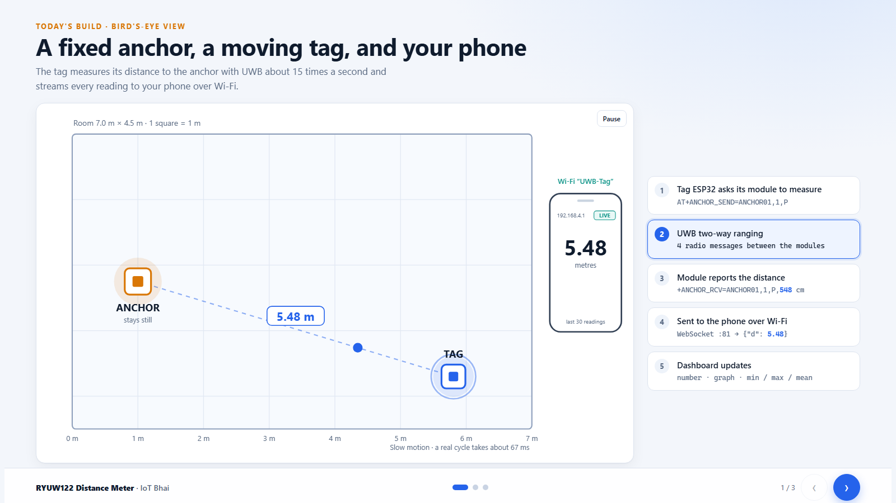
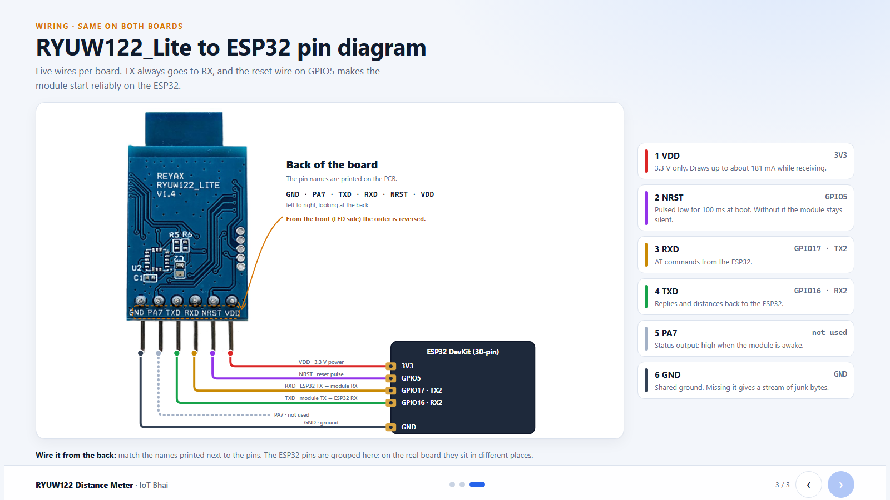
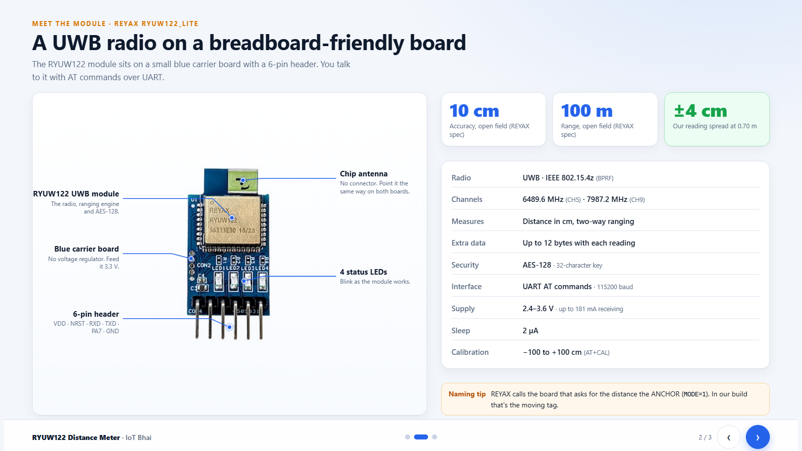
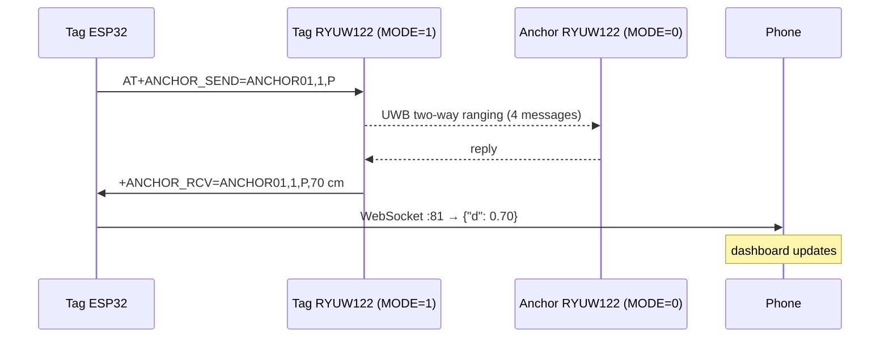

<h1 align="center">📡 UWB Distance Meter · ESP32 + REYAX RYUW122</h1>

<p align="center">
  Measure the distance between two boards to the centimetre with Ultra-Wideband,<br>
  and watch it live on your phone over Wi-Fi.
</p>

<p align="center">
  
  
  
  
  
</p>

<p align="center">
  
</p>

---

## ✨ What it does

- **Two boards, one number.** A fixed **anchor** and a moving **tag**, each an ESP32 with a RYUW122_Lite UWB module.
- **About 15 readings a second.** The tag runs UWB two-way ranging against the anchor continuously.
- **Live phone dashboard.** The tag creates its own Wi-Fi network and serves a dashboard with a big distance readout, a 10-second graph, min / max / mean / σ, and a distance alarm.
- **No app, no internet.** Join the `UWB-Tag` Wi-Fi and open `http://192.168.4.1/`.
- **Tested on real hardware:** readings stayed within **±4 cm** at 0.70 m.

## 🧰 Hardware

| Qty | Part | Notes |
|:--:|---|---|
| 2 | ESP32 dev board | Tested on a 30-pin DevKit (ESP32-D0WD-V3) |
| 2 | REYAX **RYUW122_Lite** | UWB module on a 6-pin breakout, 3.3 V only |
| 10 | Jumper wires | 5 per board |

## 🔌 Wiring

Wire both boards **the same way**.

<p align="center">
  
</p>

| RYUW122_Lite | ESP32 | Purpose |
|---|---|---|
| **VDD** | `3V3` | 3.3 V power. The Lite has **no regulator**, so never 5 V. |
| **NRST** | `GPIO5` | Reset pulse at boot. **Required on ESP32.** |
| **RXD** | `GPIO17` (TX2) | AT commands from the ESP32 |
| **TXD** | `GPIO16` (RX2) | Replies and distances back to the ESP32 |
| **PA7** | not connected | Status output |
| **GND** | `GND` | Common ground |

> [!TIP]
> Looking at the **back** of the board, the pins read `GND · PA7 · TXD · RXD · NRST · VDD` from left to right. From the front (LED side) the order is reversed.

## 📦 The module

<p align="center">
  
</p>

| | |
|---|---|
| Radio | UWB, IEEE 802.15.4z (BPRF), CH5 6489.6 MHz / CH9 7987.2 MHz |
| Ranging | Two-way ranging, distance reported in cm |
| Security | AES-128 (32-character hex key) |
| Interface | UART AT commands, 115200 baud 8N1 |
| Supply | 2.4–3.6 V, up to ~181 mA while receiving |
| REYAX spec | 10 cm accuracy, 100 m range (both open field) |

## ⚙️ How it works



> [!NOTE]
> REYAX role names are the other way round from this project. The module that **asks** for the distance is a REYAX **ANCHOR** (`AT+MODE=1`), which is our moving tag. The module that **answers** is a REYAX **TAG** (`AT+MODE=0`), which is our fixed anchor.

## 🚀 Getting started

### 1. Install

- [Arduino IDE](https://www.arduino.cc/en/software) with the **ESP32 board package** (tested on 3.3.3)
- Library: **WebSockets** by Markus Sattler (Library Manager, tested on 2.7.2)

### 2. Flash the anchor

Open [`RYUM122_Lite_UWB_Anchor/`](RYUM122_Lite_UWB_Anchor) and upload it to the first ESP32. In Serial Monitor (115200) you should see:

```text
>> AT+NETWORKID=IOTBHAI1
<< +OK
...
-- verify --
<< +MODE=0
<< +NETWORKID=IOTBHAI1
<< +ADDRESS=ANCHOR01
Anchor ready. Waiting for ranging requests...
```

### 3. Flash the tag

Open [`RYUM122_Lite_UWB_Tag/`](RYUM122_Lite_UWB_Tag) and upload it to the second ESP32:

```text
AP  SSID: UWB-Tag
    PASS: iotbhai123
    URL : http://192.168.4.1
Ready. Ranging starts now.
d = 0.70 m
d = 0.71 m
```

### 4. Open the dashboard

Connect your phone to **`UWB-Tag`** (password `iotbhai123`) and open **http://192.168.4.1/**.

## 🎯 Calibration

Every module has a small fixed offset. To remove it:

1. Place the boards exactly **3.00 m** apart.
2. Read the **Mean** tile on the dashboard for about 10 seconds.
3. Set the difference in the tag sketch, for example if Mean reads 3.12 m:
   ```cpp
   const float CAL_OFFSET_M = -0.12f;
   ```
4. Reflash the tag.

## 🔧 Configuration

Both sketches must share these values:

| Setting | Value | Rule |
|---|---|---|
| `NET_ID` | `IOTBHAI1` | exactly 8 characters |
| `NET_PIN` | `10203040506070801020304050607080` | exactly 32 hex characters |
| Anchor `MY_ADDR` | `ANCHOR01` | exactly 8 characters |
| Tag `MY_ADDR` / `PEER_ADDR` | `TAG00001` / `ANCHOR01` | exactly 8 characters |

## 🩺 Troubleshooting

| Symptom | Cause and fix |
|---|---|
| Junk characters in Serial Monitor | TX/RX swapped or GND missing. Module **TXD → GPIO16**, **RXD → GPIO17**. |
| Module never answers `AT` | NRST not wired. The ESP32 must pulse **NRST (GPIO5)** low after `UWB.begin()`. |
| `+ERR=3` on a setting | NETWORKID/ADDRESS must be 8 characters, CPIN 32 hex characters. |
| `+ERR=1` or cut-off replies | Commands sent too fast. The sketches already pause and retry. |
| Tag prints `range: no reply` | Network ID, key or addresses don't match between the two boards. |
| `WebSocketsServer.h: No such file` | Install **WebSockets** by Markus Sattler. |

## 📁 Project structure

```text
├── RYUM122_Lite_UWB_Anchor/
│   └── RYUM122_Lite_UWB_Anchor.ino   # fixed node, answers ranging requests
├── RYUM122_Lite_UWB_Tag/
│   ├── RYUM122_Lite_UWB_Tag.ino      # moving node, ranging + Wi-Fi AP + WebSocket
│   └── dashboard.h                   # phone dashboard (HTML/CSS/JS)
└── docs/images/                      # screenshots used in this README
```

## 🗺️ What's next

- 3 anchors + 1 tag for **2D indoor positioning** (trilateration)
- MQTT output for IoT dashboards

---

<p align="center">
  Made by <b>Tipu · IoT Bhai</b> · If this helped, give it a ⭐
</p>
